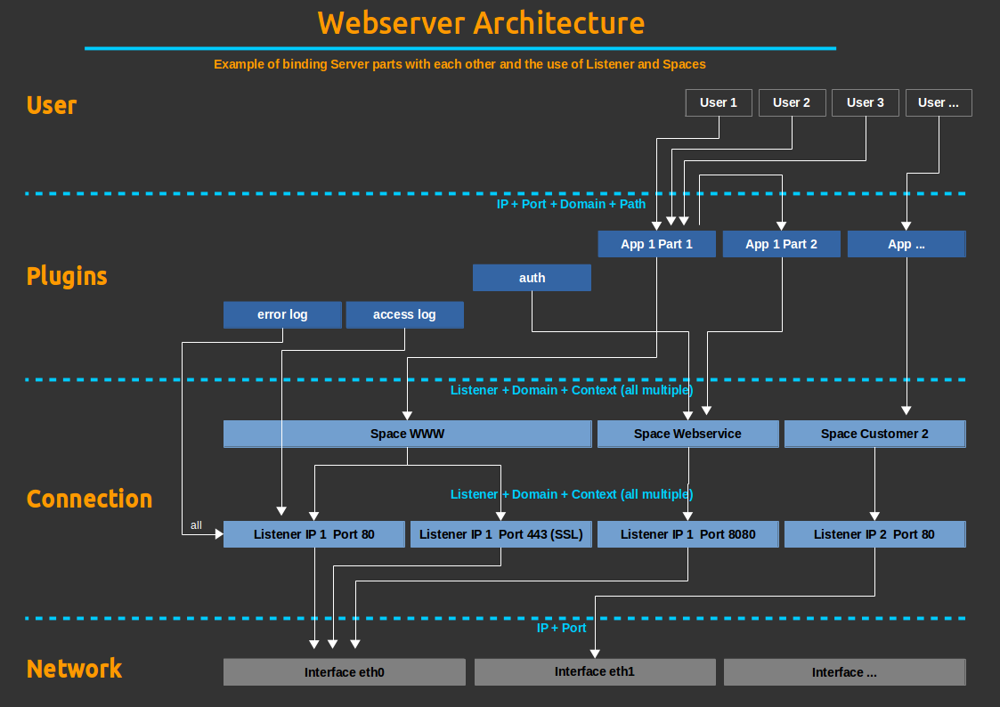

Alinex web server
=================================================

[](https://travis-ci.org/alinex/node-server)
[](https://coveralls.io/r/alinex/node-server?branch=master)
[](https://gemnasium.com/alinex/node-server)

The alinex server is a simple base system making it possible to easily use it for
any application. The main part is it's HTTP/HTTPS server part but it may also include
other server protocols like ftp later.

- full configurable
- supports multiple IPs, ports, ssl
- support vhost and spaces
- full debug and logging support
- authentication
- forwarding and redirects
- proxy support

> It is one of the modules of the [Alinex Universe](http://alinex.github.io/code.html)
> following the code standards defined in the [General Docs](http://alinex.github.io/node-alinex).


Install
-------------------------------------------------

[
 
](https://www.npmjs.com/package/alinex-server)

The easiest way is to let npm add the module directly to your modules
(from within you node modules directory):

``` sh
npm install alinex-server --save
```

And update it to the latest version later:

``` sh
npm update alinex-server --save
```

Always have a look at the latest [changes](Changelog.md).


Usage
-------------------------------------------------

The usage is very simple, you have to load the server module first:

``` coffee
server = require 'alinex-server'
```

### Setup

After that in your code you have to initialize the server:

``` coffee
server.init (err) ->
  return cb err if err
  # go on
```

Now you may add some specific routes:

``` coffee
server.route
  path: '/my-path'
  handler: (request, reply) ->
    # function handling this request
```

### Start

``` coffee
server.http.start ->
  # server is running
```


Webserver Architecture
-------------------------------------------------
At the base this module manages any server like an HTTP or HTTPS server. Therefore
it includes the basic server technology without specific applications.

Just now the only possible server is an http server.

The following architecture shows you how it is organized internally to learn how
to customize it to your needs.



The server has two different bindings, first it should bind to the network to get
the requests. Second it allows binding plugins to specific requests.

The arrows will show you some of the possibilities to connect the different server
parts together. Because of the possibilities it may look complex at first.

### Listener

The basic part of the connection to the network are the listeners. The server may
listen on multiple or all IP addresses of the local host and may bind to multiple
ports with HTTP or HTTPS protocols. For each Port binding and specific IP an extra
listener has to be created.

The different listeners bundle all the used network connections for the server
together and their names may be used later to bind spaces or apps to it.
It also defines if an SSL protocol (HTTPS) will be used.

The concrete listener, virtual host (used Domain) and context (path) may be used
to bind spaces and plugin to them.

### Spaces

To make administration of complex and big servers easier you may use spaces. They
define an area over some parts of one or multiple listeners which belongs together.
It is not necessary to do so but it helps you to make configuration easier and
put all configurations of one space together.

If spaces are used and you bind a plugin to them the plugin will be bound only to
this area or a subpart of it if specified.

### Plugins

Everything a user can use is specified using some plugins which may have their own
configuration. They will be bound to a space, listener, domain and context path.

In the configuration you define them below the spaces to bind them to it or directly
below the `http` element to directly bind to the listeners. If you want a plugin to
be bound to multiple spaces you have to bind it directly to the listener or make
multiple entries for it.

### Routes

The route specifies the handler for a specific URI scheme. Use it to add functionality
to the server. Or you may collect some routes together in a plugin which you may
add.


Configuration
-------------------------------------------------
The main configuration is done using the [Config](http://alinex.github.io/node-config)
module so that the end user may easily configure the server without changing the
code.

See the files for `server/http' configuration to get a list of all possibilities.


Routes
-------------------------------------------------
A route can be bind to one of the following (bind params):

- space
- listener
- domain
- context

And it will work on one of the following:

- path
- method

What to do will be set up using:

- config
- handler

As handler you may also use the predefined ones:

- file
- directory


Server start
-------------------------------------------------

The server will response after a short time with it's routing table on the console.
You are now able to access the server.


API
-------------------------------------------------


License
-------------------------------------------------

Copyright 2015 Alexander Schilling

Licensed under the Apache License, Version 2.0 (the "License");
you may not use this file except in compliance with the License.
You may obtain a copy of the License at

>  <http://www.apache.org/licenses/LICENSE-2.0>

Unless required by applicable law or agreed to in writing, software
distributed under the License is distributed on an "AS IS" BASIS,
WITHOUT WARRANTIES OR CONDITIONS OF ANY KIND, either express or implied.
See the License for the specific language governing permissions and
limitations under the License.
